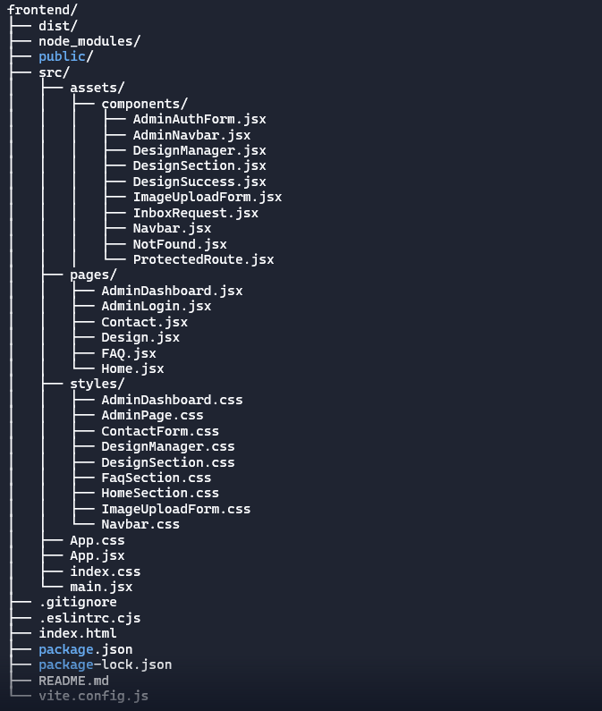

## 🌿 HennaBloom Studio 
HennaBloom Studio is a simple web app where customers can browse henna designs and book orders. 
The artist uses a private admin dashboard to manage designs—adding, editing, or deleting them. 
Built with a clean, minimalist interface and modular architecture, the app showcases real-world CRUD 
functionality, seamless frontend-backend integration. It’s built with React, Express, MongoDB, and Axios to keep everything connected and easy to use.

## 🛠️  Back End git Repo
 https://github.com/savita-aher/HennaStudio_BackEnd

## ✨ Features
 Customer View
- Browse henna designs by category
- View design details including price and style tag

Contact Page
- Responsive form for inquiries or custom design requests
- Fields: name, email, phone, message, and optional image (URL or file)
- Radio toggle to conditionally show upload options
- POSTs data to backend and shows success feedback

Admin Dashboard (Protected)
- Login with email and password
- Add, edit, and delete henna designs
- Update price and style tag directly from design manager
- Upload images via Cloudinary
- Success messages and consistent image sizing across categories

FAQ Section
- Dynamically fetches frequently asked questions from backend
- Displays answers in a collapsible accordion layout
- Helps users understand booking policies, design categories, and customization    options

## 🧱 Tech Stack
- React (Vite setup)
- Axios for API communication
- CSS modules and dashboard.css for scoped styling
- React Router 

## 📁 Folder Structure

## 🚀 Getting Started
# 1. Clone the repo
- git clone https://github.com/savita-aher/HennaStudio_FrontEnd

# 2. Install dependencies
- npm install
- npm install axios

# 3. Start development server
- Start backend: npm run dev
- Start frontend: npm run dev

# 4. Visit the app
- http://localhost:5173

## 👩‍💻 Author
Savita Aher

